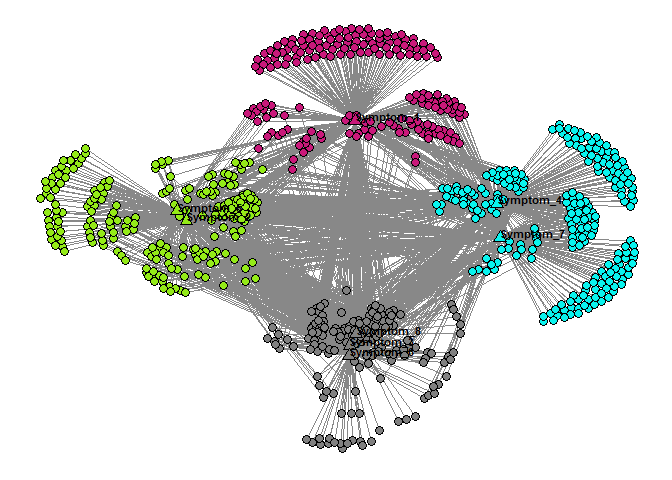

<!-- README.md is generated from README.Rmd. Please edit that file -->

# ExplodeLayout

<!-- badges: start -->
<!-- badges: end -->

The ExplodeLayout algorithm takes as input (1) an edge list of a
unipartite or bipartite network, (2) node layout coordinates (x, y)
generated by a layout algorithm such as Kamada Kawai, (3) node cluster
membership generated from a clustering algorithm such as modularity
maximization, and (4) a radius to enable the node clusters to be
“exploded” to reduce their overlap. The algorithm uses these inputs to
generate new layout coordinates of the nodes which “explodes” the
clusters apart, such that the edge lengths within the clusters are
preserved, while the edge lengths between clusters are recalculated. The
modified network layout with nodes and edges are displayed in two
dimensions. This package is a basic version of an earlier version called
[epl](https://github.com/UTMB-DIVA-Lab/epl) that offered multiple ways
to separate clusters in a network (see PMID: 28815099).

## Installation

You can install the development version of ExplodeLayout like so:

``` r
install.packages("remotes")
remotes::install_github("DIVA-Lab-UTMB/ExplodeLayout")
```

## Example

The following describes how to use ExplodeLayout for a simple network:

``` r
library(ExplodeLayout)
str(example_nodelist)
#> 'data.frame':    806 obs. of  5 variables:
#>  $ Label  : chr  "Patient_1" "Patient_2" "Patient_3" "Patient_4" ...
#>  $ Cluster: int  2 2 2 4 4 2 3 2 4 2 ...
#>  $ X      : num  3.379 2.242 -1.436 0.465 4.62 ...
#>  $ Y      : num  3.06 2.07 -3.47 2.26 2.8 ...
#>  $ Entity : num  1 1 1 1 1 1 1 1 1 1 ...
str(example_incidmat)
#> 'data.frame':    798 obs. of  8 variables:
#>  $ Symptom_1: int  1 1 0 1 1 1 0 1 0 0 ...
#>  $ Symptom_2: int  1 1 0 1 1 1 0 1 1 0 ...
#>  $ Symptom_3: int  1 1 0 1 0 0 0 0 1 0 ...
#>  $ Symptom_4: int  1 1 0 1 1 1 1 1 1 0 ...
#>  $ Symptom_5: int  1 1 1 1 0 1 0 1 1 1 ...
#>  $ Symptom_6: int  0 1 0 1 1 1 0 1 1 0 ...
#>  $ Symptom_7: int  1 1 0 0 1 1 1 1 1 0 ...
#>  $ Symptom_8: int  1 0 1 1 1 1 0 1 1 0 ...
exploded_nodelist=get_explode_nodelist(example_nodelist,radius=1.2)
str(exploded_nodelist)
#> 'data.frame':    806 obs. of  5 variables:
#>  $ Label    : chr  "Patient_1" "Patient_2" "Patient_3" "Patient_4" ...
#>  $ X        : num  -3.579 -5.075 -11.646 0.569 4.626 ...
#>  $ Y        : num  3.02 3.19 2.17 -6.8 -5.75 ...
#>  $ Color    : chr  "#94EA18" "#94EA18" "#94EA18" "#808080" ...
#>  $ baseShape: num  21 21 21 21 21 21 21 21 21 21 ...
p=plot_binet_ggplot2(exploded_nodelist,example_incidmat)
print(p)
```



## Documentation

Please read the documentation using `?get_explode_nodelist`,
`?plot_binet_ggplot2`, `?example_nodelist`, or `?example_incidmat` for
more details.

## Reference

[Bhavnani(2017)](https://www.ncbi.nlm.nih.gov/pmc/articles/PMC5543384/pdf/2613038.pdf)
